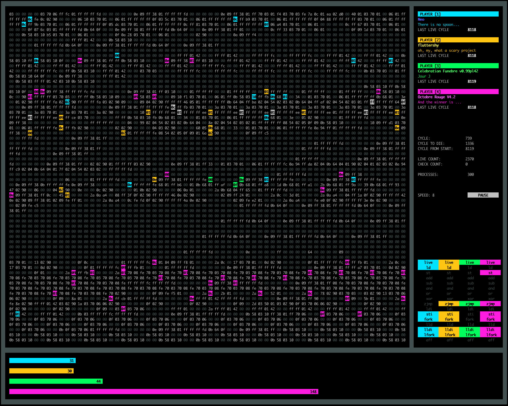

# 🤖 CoreWar 🤖
Core War is a programming game in which two or more battle programs (`champions`) fights in memory area of virtual machine. 
At the beginning of a game, each champion is loaded into memory at a random location, after which each program executes one instruction in turn. The goal of the game is to cause the processes of opposing programs to terminate (which happens if they execute an invalid instruction), leaving the victorious program in sole.


## 🤖     Champion

Champion is a battle program written in low-level language similar to assembly.
The codes of Champions are executed sequentially within the same virtual machine and memory space. They can therefore, among other things, write and rewrite on top of each others so to corrupt one another, force the others to execute instructions that can damage them, etc... The game ends when all the processes are dead. The winner is the last player reported to be “alive”.

## 🔡     Assembler

This is the program that gets file with champion code as argument, compiles and translates them from the assembly language into `bytecode`. Bytecode is a machine code, which will be directly interpreted by the virtual machine.

There are 16 instructions used in Asm
```
1  live		alive
2  ld		load
3  st		store
4  add		addition
5  sub		subtraction
6  and		bitwise AND
7  or		bitwise OR
8  xor		bitwise XOR
9  zjmp		jump if non-zero
10 ldi		load index
11 sti		store index
12 fork		fork
13 lld		long load
14 lldi		long load index
15 lfork	long fork
16 aff		aff
```

## 🔢     Disassembler

This is the program that translates back the bytecode into assembly language.

## ▶️     Virtual machine
The virtual machine creates a memory space dedicated to the combat of the players, it then loads each champion and their associated processes and executes them sequentially until they die.
Virtual machine executes bytecode that was generated by assembler. 


## 🎦     Visualization

- ncurses (-nc flag)



- javascript (-w flag)


## ℹ️     Install
```
git clone https://github.com/gitEllE-if/CoreWar.git corewar
cd corewar
make
```
The program is tested and run on MacOS (Mojave, HighSierra, Catalina)

## ℹ️     Usage

- assembler
```
./asm -a file.s
```
- disassembler
```
./asm -d file.cor
```
example: `./asm -a champions/neo.s`

- virtual machine
```
./corewar [-dump nbr_cycles -v N | -nc | -w] [-o] [-l] [[-n number] champion1.cor] ...

          -dump nbr_cycles  : Dump the memory on the standard output and quit the game
          -n number         : Sets the number of the next player
          -v N              : Verbosity levels, can be added together to enable several
                              - 0   Show only essentials
                              - 1   Show lives
                              - 2   Show cycles
                              - 4   Show operations (Params are NOT literal ...)
                              - 8   Show deaths\n"
                              - 16  Show PC movements (Except for jumps)
          -nc               : Ncurses output mode
          -w                : Web output mode
          -l                : Hide display live instruction
          -o                : Original behaviour
```
example: `./corewar -w -n 1 champions/neo.cor -n 2 champions/jumper.cor`

### 🚻    Authors

- asm/disasm and visualization - me
- virtual machine - [Maksim](https://github.com/Qvasov) and ddarell
- champion(neo.s) and tests - aagripin

### ℹ️    Thanks

Thanks to [VBrazhnik](https://github.com/VBrazhnik/Corewar/wiki), [JohnSzaboJr](https://github.com/JohnSzaboJr) for the explanation and inspiration
